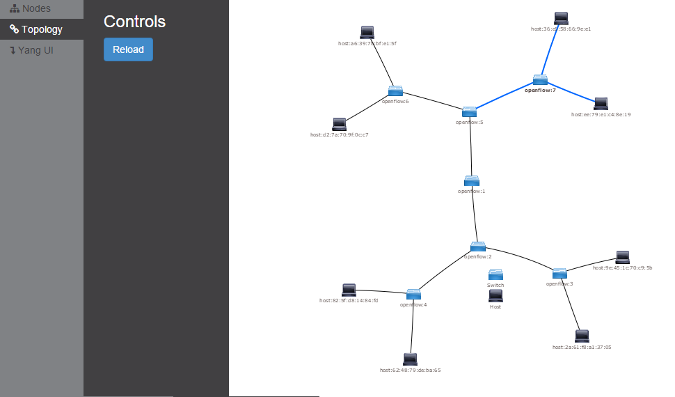
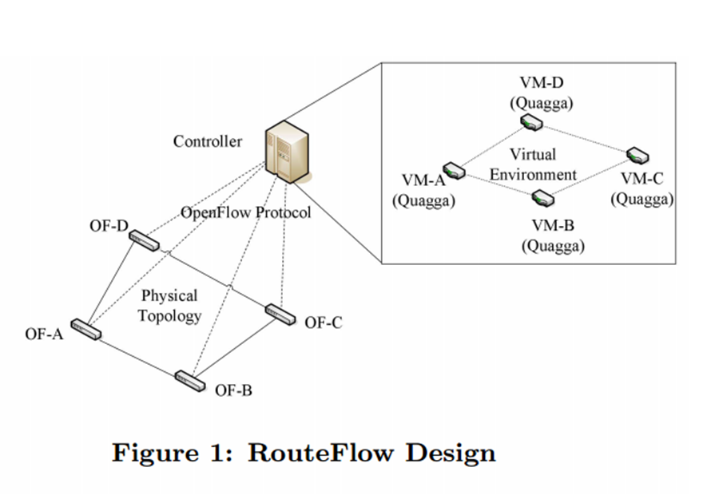
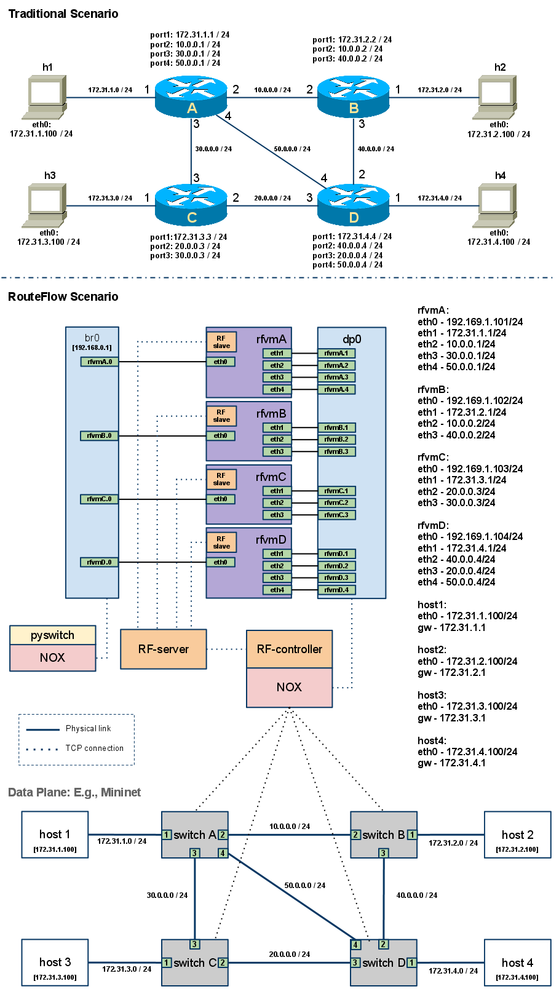
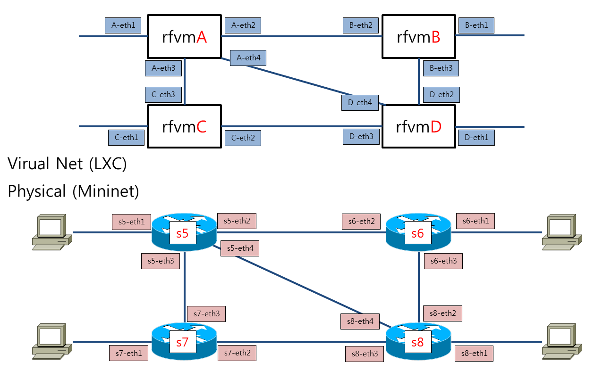
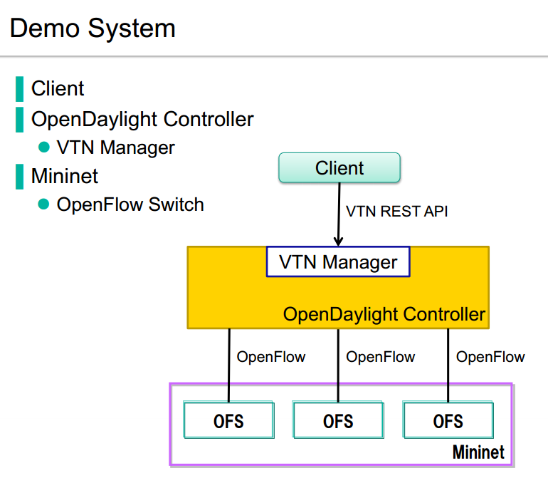
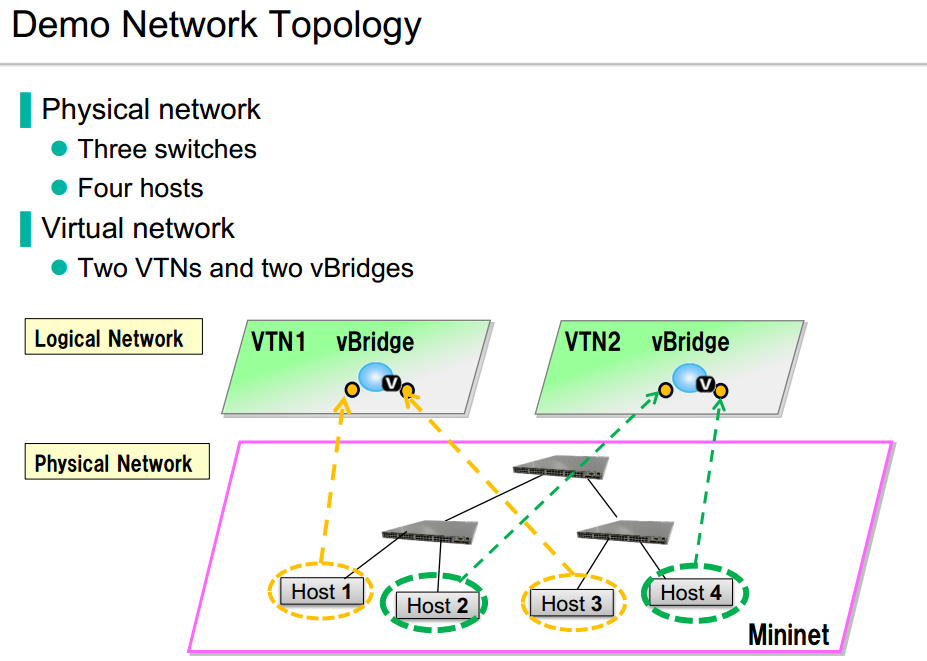
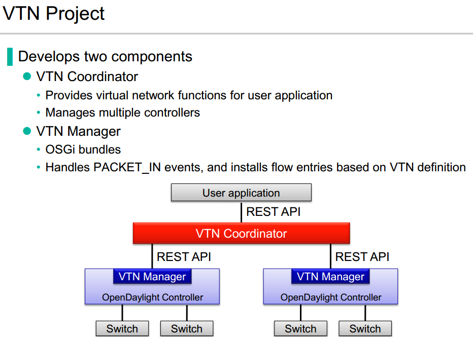
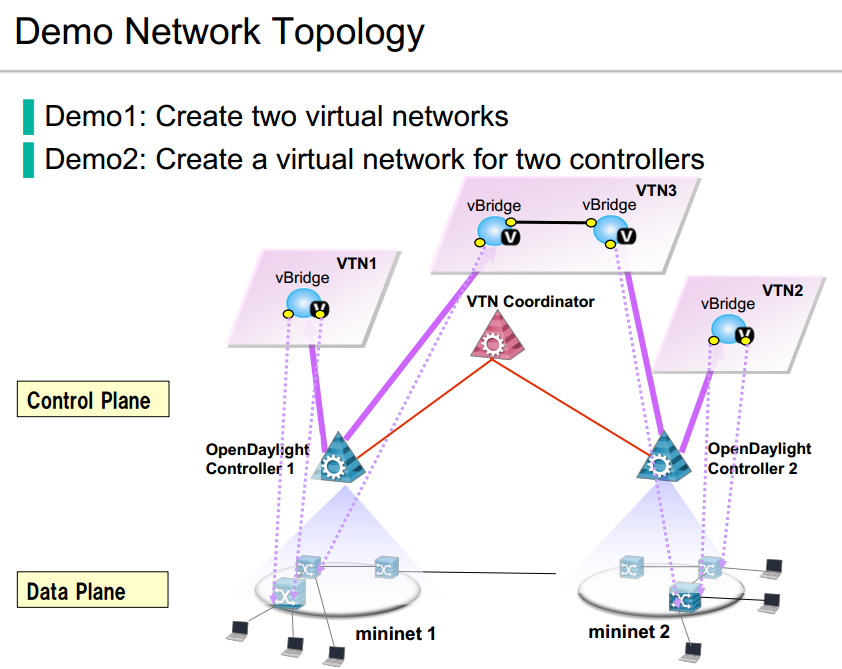
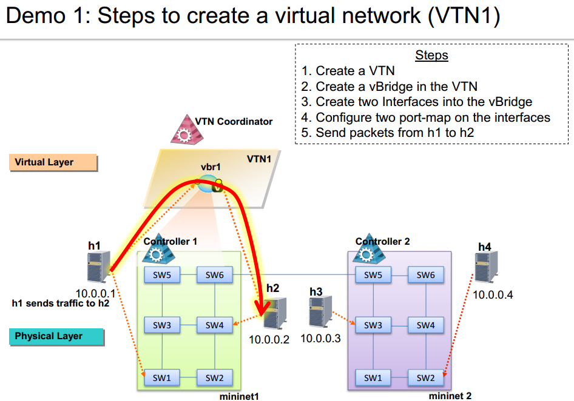
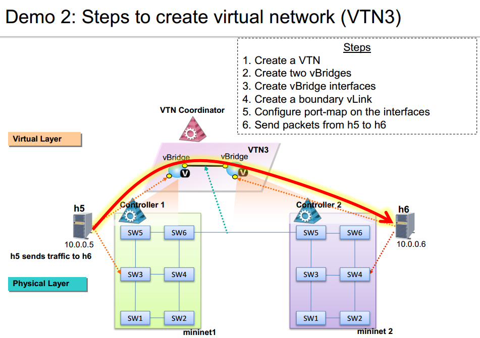

# Description

SDN Test Suite

# Intro

## Tested Physical Env.

* OS: Ubuntu 12.04.4 LTS amd64 (3.11.0-15-generic / 8Cores / 8GB RAM)
* Vagrant: 1.6.5
* VirtualBox: 4.3.18 r96516 (/w Oracle VM VirtualBox Extension Pack)

## Vagrant-based SDN Test Suite.

* OpenDaylight /w Mininet
* RouteFlow
* DevStack /w OpenDaylight
* VXLAN /w OVS
* VTN Coordinator

## Vagrant VM List

```
$ vagrant status

Current machine states:

opendaylight-mininet-1    not created (virtualbox)
opendaylight-mininet-2    not created (virtualbox)
routeflow                 not created (virtualbox)
devstack-control          not created (virtualbox)
devstack-compute-1        not created (virtualbox)
devstack-compute-2        not created (virtualbox)
devstack-compute-3        not created (virtualbox)
vxlan-router              not created (virtualbox)
vxlan-server1             not created (virtualbox)
vxlan-server2             not created (virtualbox)
vtn-coordinator           not created (virtualbox)
```

# OpenDaylight /w Mininet

SDN Controller, OpenDaylight TESTing with Mininet

## Sample OpenDaylight Helium Web-UI



## Start Vagrant

`host> vagrant up opendaylight-mininet-1`

## Components of VM

* OpenDaylight(Helium Pre-Built)
* Mininet 2.1.x
* Wireshark /w OF Plugin

## Run OpenDaylight (Helium)

* Run OpenDaylight

      `host> vagrant ssh opendaylight-mininet-1`

      `vm> cd /home/vagrant/opendaylight`

      `vm> ./run-karaf.sh`

      `e.g. for OVS) opendaylight-user@root> feature:install odl-dlux-core odl-restconf odl-nsf-all odl-adsal-northbound odl-mdsal-apidocs odl-l2switch-switch`

* Web-UI

      Browser: `http://{Vagrant Host IP}:8181/dlux/index.html`
      Default ID/PW: `admin / admin`

## Run Mininet

* Common Topology

      `host> vagrant ssh opendaylight-mininet-1`

      `vm> sudo mn --controller remote,ip=127.0.0.1,port=6633 --switch ovsk --topo tree,3`


* Custom Topologys

      `vm> cd /home/vagrant/topo-mininet`

      `vm> cd /home/vagrant/mininet-examples`

# RouteFlow

RouteFlow, is an open source project to provide virtualized IP routing services over OpenFlow enabled hardware.

Home: https://sites.google.com/site/routeflow/home

Video: https://www.youtube.com/watch?v=YduxuBTyjEw

(Note) OpenFlow1.0 Based

## RouteFlow Design



## Start Vagrant

`host> vagrant up routeflow`

## Architecture of Tutorial-2 Demo

RouteFlow Document: https://sites.google.com/site/routeflow/documents/tutorial2-four-routers-with-ospf



## Components of VM

* RouteFlow
* OpenDaylight(Hydrogen Source) & RFProxy(for OpenDaylight)
* Mininet
* NOX(Default: Disabled)
  * `/home/vagrant/RouteFlow-Test/RouteFlow/rftest/rftest2`
* LXC Container (for Simulation Quagga's OSPF, BGP, RIP)

## Run OpenDaylight (Hydrogen)

* Run OpenDaylight

      `host> vagrant ssh routeflow`

      `vm> cd /home/vagrant/opendaylight`

      `vm> ./run.sh`

* Web-UI (OpenDaylight)

      Browser: `http://{Vagratn Host IP}:8080`
      Default ID/PW: `admin / admin`

## Run RouteFlow Tutorial-2

* Run RouteFlow

      `host> vagrant ssh routeflow`

      `vm> cd /home/vagrant/RouteFlow-Test/RouteFlow/rftest/`

      `vm> sudo ./rftest2`

* RouteFlow Web-UI

      `host> vagrant ssh routeflow`

      `vm> cd /home/vagrant/RouteFlow-Test/RouteFlow/rfweb`

      `vm> gunicorn -w 4 -b 0.0.0.0:8111 rfweb:application`

      Browser: `http://Vagrant Host IP}:8111/index.html`

## Run Mininet

* Run Mininet (Virtual Infra)

      `host> vagrant ssh routeflow`

      `vm> cd /home/vagrant/rf-topo-mininet/`

      `vm> sudo ./run-routeflow-infra.sh`

## RouteFlow Mapping Virtual-Router & Physical-Router



## RouteFlow APPENDIX

* Tutorial-1 (rftest1)
  * https://github.com/CPqD/RouteFlow/wiki/Tutorial-1:-rftest1
* Tutorial-2 (rftest2)
  * https://github.com/CPqD/RouteFlow/wiki/Tutorial-2:-rftest2
* RouteFlow Web-UI Sample


# DevStack /w OpenDaylight

* (Note) *Order is important!*
* DevStack
  * Controller/Network Node: 1 Host
    * (Note) Minimum RAM Size: 4GB
  * Compute Node: 1 Host (Max: 3)
* OpenDaylight (Helium Pre-Built)

## Start Vagrant

1. `host> vagrant up devstack-control`
2. `host> vagrant up devstack-compute-1`
  * (Note) After 'devstack-control' completed...

## 1st, Run OpenDaylight (Helium Pre-Built)

* Run by 'karaf'

      `host> vagrant ssh devstack-control`

      `vm> cd /home/vagrant/opendaylight`

      `vm> ./run-karaf.sh`

      `opendaylight-user@root> feature:install odl-ovsdb-openstack odl-ovsdb-northbound odl-restconf odl-mdsal-apidocs odl-adsal-all odl-adsal-northbound odl-dlux-core`

* Web-UI

      Browser: `http://{Vagrant Host IP}:8181/dlux/index.html`

      Default ID/PW: `admin / admin`

## 2nd, Run Control/Network Node

### Run stack.sh

      `host> vagrant ssh devstack-control`

      `vm> cd /home/vagrant/devstack`

      `vm> ./stack.sh

      Browser: `http://{Vagratn Host IP}`

## 3rd, Run Compute-1 Node (also Compute-2, Compute-3)

### Run stack.sh

      `host> vagrant ssh devstack-compute-1`

      `vm> cd /home/vagrant/devstack`

      `vm> ./stack.sh`

## Demo Scenario (Creating Overlay Networks)

### CMD TXT

[devstack-control> cat /home/vagrant/devstack/devstack-overlay-demo-cmd.txt](resources/puppet/files/devstack-overlay-demo-cmd.txt)

### SSH to VM (cirros)

      `host> vagrant ssh devstack-control`

      `vm> ip netns exec {QROUTER's UUID} ssh cirros@{VM's IP}`
          `e.g.) ip netns exec qrouter-a4e4c152-ee23-4e16-b900-4d0c132618d7 ssh cirros@10.1.1.4`
	  `Login ID/PW: "cirros / cubswin:)"`

### Sample ScreenShot


(Ref) http://networkstatic.net/opendaylight-openstack-integration-devstack-fedora-20/

# VXLAN /w OVS

* L2 over L3 Networking
* Configuration of VXLAN tunnel ports in OVS
* Configuration of OpenFlow entries OVS
* Logical separation of traffic between tenants
* TODO
  * Flow by OpenDaylight
  * Underlay /w Mininet

## Start Vagrant

(Note) *Order is important!*

1. `host> vagrant up vxlan-router`

2. `host> vagrant up vxlan-server1`

3. `host> vagrant up vxlan-server2`

## Underlay View

* Underlay: 192.168.1.0/24, 192.168.2.0/24


## Overlay View

* Overlay: 10.0.0.0/8 per Tenant
  * RED VNI: 100
  * BLUE VNI: 200


## vxlan-router

* Router Role, between 192.168.1.0/24 and 192.168.2.0/24

## vxlan-server1

* IP: 192.168.1.10
* RED, BLUE Network's Underlay for 2 VMs
  * 10.0.0.1/8 (VNI100-RED1)
  * 10.0.0.1/8 (VNI200-BLUE1)

### Run vxlan-server1

* Command TXT File: /home/vagrant/topo-vxlan/vxlan-server1/cmd-server1.txt

      `cd /home/vagrant/topo-vxlan/vxlan-server1`

      `sudo mn --custom vxlan-server1.py --topo vxlan-server1`

      `mininet> sh ovs-vsctl add-port s1 vtep -- set interface vtep type=vxlan option:remote_ip=192.168.2.20 option:key=flow ofport_request=10`

      `mininet> sh ovs-vsctl show`

      `mininet> sh ovs-ofctl show s1`

      `mininet> sh ovs-ofctl add-flows s1 flows1.txt`

      `mininet> sh ovs-ofctl dump-flows s1`

      `mininet> red1 ping 10.0.0.1`

      `mininet> red1 ping 10.0.0.2`

      `mininet> blue1 ping 10.0.0.1`

      `mininet> blue1 ping 10.0.0.2`

### Appendix: flows1.txt

```
table=0,in_port=1,actions=set_field:100->tun_id,resubmit(,1)
table=0,in_port=2,actions=set_field:200->tun_id,resubmit(,1)
table=0,actions=resubmit(,1)

table=1,tun_id=100,dl_dst=00:00:00:00:00:01,actions=output:1
table=1,tun_id=200,dl_dst=00:00:00:00:00:01,actions=output:2
table=1,tun_id=100,dl_dst=00:00:00:00:00:02,actions=output:10
table=1,tun_id=200,dl_dst=00:00:00:00:00:02,actions=output:10
table=1,tun_id=100,arp,nw_dst=10.0.0.1,actions=output:1
table=1,tun_id=200,arp,nw_dst=10.0.0.1,actions=output:2
table=1,tun_id=100,arp,nw_dst=10.0.0.2,actions=output:10
table=1,tun_id=200,arp,nw_dst=10.0.0.2,actions=output:10
table=1,priority=100,actions=drop
```

## vxlan-server2

* IP: 192.168.2.20
* RED, BLUE Network's Underlay for 2 VMs
  * 10.0.0.2/8 (VNI100-RED2)
  * 10.0.0.2/8 (VNI200-BLUE2)

### Run vxlan-server2

* Command TXT File: /home/vagrant/topo-vxlan/vxlan-server2/cmd-server2.txt

      `cd /home/vagrant/topo-vxlan/vxlan-server2`

      `sudo mn --custom vxlan-server2.py --topo vxlan-server2`

      `mininet> sh ovs-vsctl add-port s2 vtep -- set interface vtep type=vxlan option:remote_ip=192.168.1.10 option:key=flow ofport_request=10`

      `mininet> sh ovs-vsctl show`

      `mininet> sh ovs-ofctl show s2`

      `mininet> sh ovs-ofctl add-flows s2 flows2.txt`

      `mininet> sh ovs-ofctl dump-flows s2`

      `mininet> red2 ping 10.0.0.1`

      `mininet> red2 ping 10.0.0.2`

      `mininet> blue2 ping 10.0.0.1`

      `mininet> blue2 ping 10.0.0.2`

### Appendix: flows2.txt

```
table=0,in_port=1,actions=set_field:100->tun_id,resubmit(,1)
table=0,in_port=2,actions=set_field:200->tun_id,resubmit(,1)
table=0,actions=resubmit(,1)

table=1,tun_id=100,dl_dst=00:00:00:00:00:01,actions=output:10
table=1,tun_id=200,dl_dst=00:00:00:00:00:01,actions=output:10
table=1,tun_id=100,dl_dst=00:00:00:00:00:02,actions=output:1
table=1,tun_id=200,dl_dst=00:00:00:00:00:02,actions=output:2
table=1,tun_id=100,arp,nw_dst=10.0.0.1,actions=output:10
table=1,tun_id=200,arp,nw_dst=10.0.0.1,actions=output:10
table=1,tun_id=100,arp,nw_dst=10.0.0.2,actions=output:1
table=1,tun_id=200,arp,nw_dst=10.0.0.2,actions=output:2
table=1,priority=100,actions=drop
```

## Ping Test

### On vxlan-server1

      `mininet> red1 ping 10.0.0.1`

      `mininet> red1 ping 10.0.0.2`

      `mininet> blue1 ping 10.0.0.1`

      `mininet> blue1 ping 10.0.0.2`

### On vxlan-server2

      `mininet> red2 ping 10.0.0.1`

      `mininet> red2 ping 10.0.0.2`

      `mininet> blue2 ping 10.0.0.1`

      `mininet> blue2 ping 10.0.0.2`

# VTN Tutorial-1 (Single Controller)

* Provides REST APIs for creating virtual L2 network
* In this demo, all packets are forwarded by the controller based on definition of VTN

## Design





## Start Vagrant

`host> vagrant up opendaylight-mininet-1`

## Run OpenDaylight (Helium)

* Run OpenDaylight

      `host> vagrant ssh opendaylight-mininet-1`

      `vm> cd /home/vagrant/opendaylight`

      `vm> ./run-karaf.sh`

      `opendaylight-user@root> feature:install odl-adsal-compatibility-all odl-openflowplugin-all odl-vtn-manager-all odl-dlux-core`

* Web-UI

      Browser: `http://{Vagrant Host IP}:8181/dlux/index.html`
      Default ID/PW: `admin / admin`

## Run Mininet

* Create Topology

      `host> vagrant ssh opendaylight-mininet-1`

      `vm> mn --controller remote,ip=127.0.0.1,port=6633 --switch ovsk,protocols=OpenFlow13 --mac --topo tree,2`

      `vm> mininet> pingall`

```
mininet> pingall

h1 -> X X X 
h2 -> X X X 
h3 -> X X X 
h4 -> X X X
```

## REST API Operation for VTN1

* Command TXT File: `/home/vagrant/RESTconf-VTN/create-VTN{1,2}.txt`

      `host> vagrant ssh opendaylight-mininet-1`

```
      vm> export VTN_OPT='--user "admin":"admin" -H "Accept: application/json" -H "Content-type: application/json"'
      vm> export VTN_URL='http://localhost:8080'

      vm> curl $VTN_OPT -X POST $VTN_URL/controller/nb/v2/vtn/default/vtns/Tenant1 -d '{"description": "VTN1"}'
      vm> curl $VTN_OPT -X POST $VTN_URL/controller/nb/v2/vtn/default/vtns/Tenant1/vbridges/vBridge1 -d '{}'
      vm> curl $VTN_OPT -X POST $VTN_URL/controller/nb/v2/vtn/default/vtns/Tenant1/vbridges/vBridge1/interfaces/if1 -d '{}'
      vm> curl $VTN_OPT -X POST $VTN_URL/controller/nb/v2/vtn/default/vtns/Tenant1/vbridges/vBridge1/interfaces/if2 -d '{}'
      vm> curl $VTN_OPT -X PUT $VTN_URL/controller/nb/v2/vtn/default/vtns/Tenant1/vbridges/vBridge1/interfaces/if1/portmap -d '{"node": {"type": "OF", "id": "00:00:00:00:00:00:00:02"}, "port": {"name": "s2-eth1"}}'
      vm> curl $VTN_OPT -X PUT $VTN_URL/controller/nb/v2/vtn/default/vtns/Tenant1/vbridges/vBridge1/interfaces/if2/portmap -d '{"node": {"type": "OF", "id": "00:00:00:00:00:00:00:03"}, "port": {"name": "s3-eth1"}}'
```

## REST API Operation for VTN2

      `host> vagrant ssh opendaylight-mininet-1`

```
      vm> export VTN_OPT='--user "admin":"admin" -H "Accept: application/json" -H "Content-type: application/json"'
      vm> export VTN_URL='http://localhost:8080'

      vm> curl $VTN_OPT -X POST $VTN_URL/controller/nb/v2/vtn/default/vtns/Tenant2 -d '{"description": "VTN2"}'
      vm> curl $VTN_OPT -X POST $VTN_URL/controller/nb/v2/vtn/default/vtns/Tenant2/vbridges/vBridge1 -d '{}'
      vm> curl $VTN_OPT -X POST $VTN_URL/controller/nb/v2/vtn/default/vtns/Tenant2/vbridges/vBridge1/interfaces/if1 -d '{}'
      vm> curl $VTN_OPT -X POST $VTN_URL/controller/nb/v2/vtn/default/vtns/Tenant2/vbridges/vBridge1/interfaces/if2 -d '{}'
      vm> curl $VTN_OPT -X PUT $VTN_URL/controller/nb/v2/vtn/default/vtns/Tenant2/vbridges/vBridge1/interfaces/if1/portmap -d '{"node": {"type": "OF", "id": "00:00:00:00:00:00:00:02"}, "port": {"name": "s2-eth2"}}'
      vm> curl $VTN_OPT -X PUT $VTN_URL/controller/nb/v2/vtn/default/vtns/Tenant2/vbridges/vBridge1/interfaces/if2/portmap -d '{"node": {"type": "OF", "id": "00:00:00:00:00:00:00:03"}, "port": {"name": "s3-eth2"}}'
```

## Result of VTN Tutorial-1

```
mininet> pingall

h1 -> X h3 X 
h2 -> X X h4 
h3 -> h1 X X 
h4 -> X h2 X

mininet> dpctl dump-flows
```
  
# VTN Tutorial-2 (Multiple Controller)

## Design









## Start Vagrant

TODO

## Run OpenDaylight-1 (Helium)

TODO

## Run OpenDaylight-2 (Helium)

TODO

## Run Mininet

TODO

## REST API Operation for VTN1

TODO

## REST API Operation for VTN2

TODO

## REST API Operation for VTN3

TODO

## Result of VTN Tutorial-2

TODO

# References

```
Vagrnatfile Ref: https://github.com/opendaylight/ovsdb/blob/master/README.Vagrant
VXLAN Ref: http://www.youtube.com/watch?v=tnSkHhsLqpM
VTN Tutorial-1 Ref: https://wiki.opendaylight.org/images/d/da/NEC_VTN_Demo_0722.pdf
VTN Tutorial-2 Ref: https://wiki.opendaylight.org/images/2/21/NEC_VTN_Demo_0910.pdf
```
