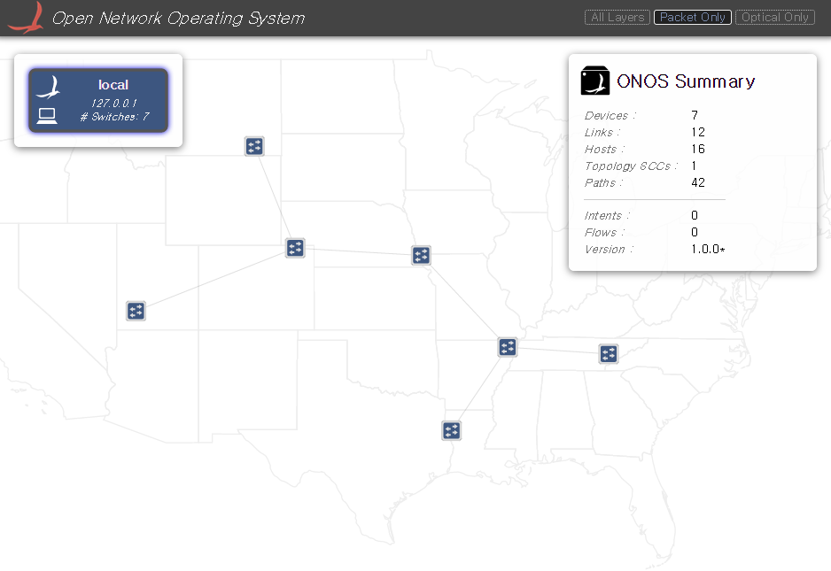
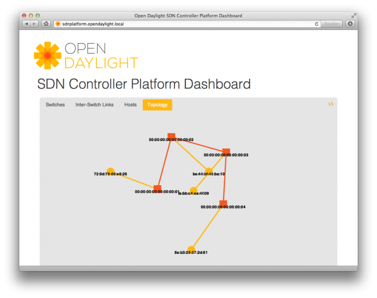
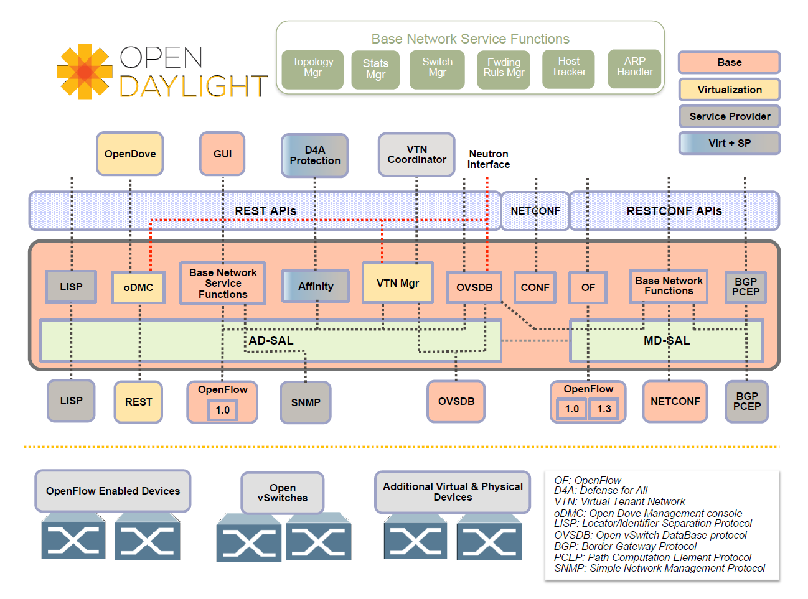
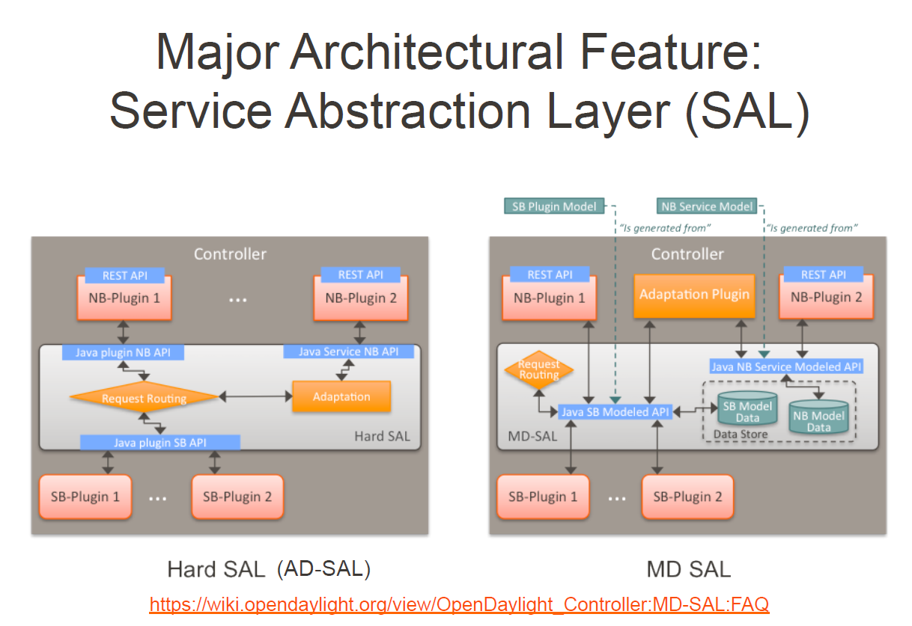
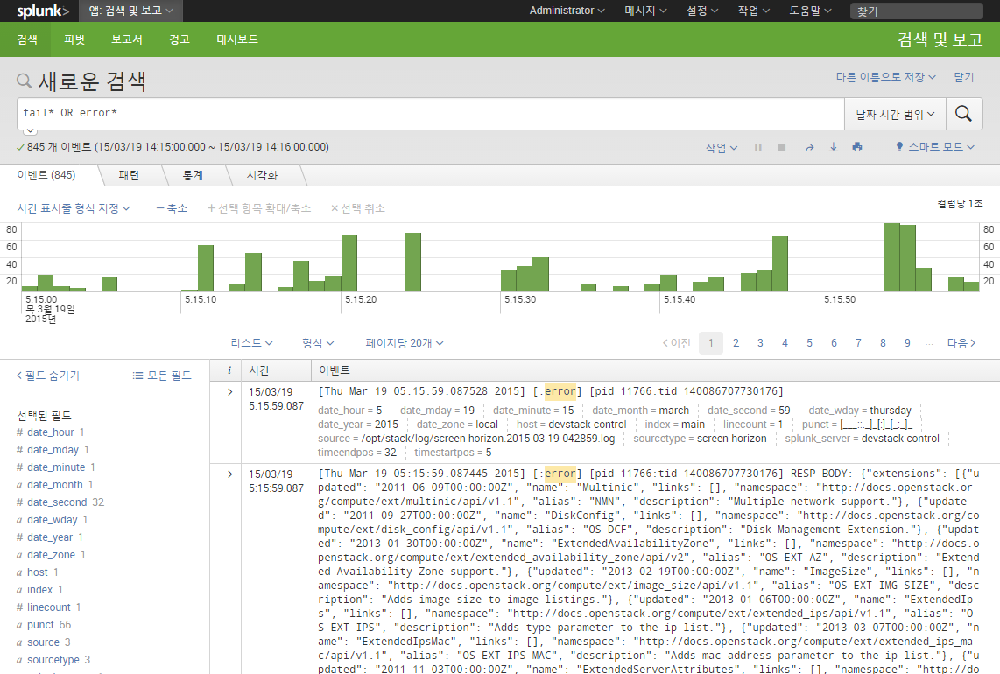
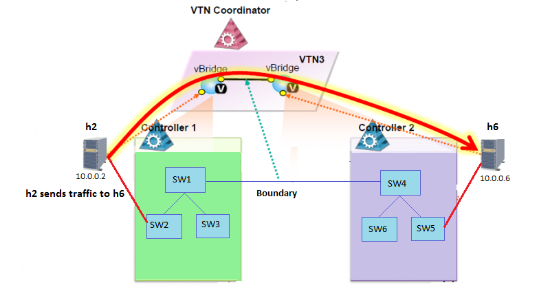

# Description

SDN Test Suite

(Note) When Oracle-Java fail, retry provision (# vagrant provision `{VM_NAME}`)

# Intro

## Tested Physical Env.

* OS: Ubuntu 12.04.4 LTS amd64 (3.11.0-15-generic / 8Cores / 8GB RAM)
* Vagrant: 1.7.2
* VirtualBox: 4.3.24 (/w Oracle VM VirtualBox Extension Pack)

## Vagrant-based SDN Test Suite.

* ONOS (Open Network Operating System) /w Mininet
* OSCP (OpenDaylight SDN Controller Platform)
* OpenDaylight /w Mininet
* RouteFlow /w Mininet
* DevStack /w OpenDaylight
* VXLAN /w OVS
* VTN /w Coordinator
* WCBench (CBench)

## Vagrant VM List

```
$ vagrant status

Current machine states:

onos                      (192.168.13.10)
oscp                      (192.168.12.10)
vtn-coordinator           (192.168.40.10)
opendaylight-mininet-1    (192.168.41.10)
opendaylight-mininet-2    (192.168.42.10)
routeflow                 (192.168.30.10)
devstack-control          (Mgm:192.168.50.10/Data:172.16.0.10/Ext:Manual)
devstack-compute        (Mgm:192.168.51.21/Data:172.16.1.21)
vxlan-router              (192.168.1.1, 192.168.2.1)
vxlan-server1             (192.168.1.10)
vxlan-server2             (192.168.2.20)
cbench                    (192.168.77.10)
```

# ONOS (Open Network Operating System) /w Mininet

## Start Vagrant

`host> vagrant up onos`

## Run ONOS

```
host> vagrant ssh onos
vm> karaf clean
vm> onos> feature:install onos-api onos-core-trivial onos-cli onos-openflow onos-app-fwd onos-app-mobility onos-gui
```
```
host> vagrant ssh onos
vm> sudo mn --controller=remote --topo=tree,3
```
## Web-UI

* Browser: `http://Vagrant Host IP:8181/onos/ui`



* Ref: https://wiki.onosproject.org/display/ONOS/Installing+and+Running+ONOS

# OSCP (OpenDaylight SDN Controller Platform)



* Ref: https://wiki.opendaylight.org/view/OpenDaylight_SDN_Controller_Platform_(OSCP):Installation

## Start Vagrant

`host> vagrant up oscp`

## Run OSCP

```
host> vagrant ssh oscp
vm> sudo mn --controller=remote,ip=127.0.0.1,port=6633 --mac --topo=linear
```
```
host> vagrant ssh oscp
vm> cd /home/vagrant/net-virt-platform
vm> source ./workspace/ve/bin/activate 
vm> (ve) make stop-sdncon reset-cassandra start-sdncon 
vm> (ve) make start-sdnplatform
vm> (ve) cd cli/
vm> (ve) ./cli.py
```
```
vm> (ve) oscp> show switch
# Switch DPID             Alias Connected Since         IP Address Tun Capable -Enabled -State   Core Switch
-|-----------------------|-----|-----------------------|----------|-----------|--------|--------|-----------
1 00:00:00:00:00:00:00:01       2014-12-23 08:40:23 UTC 127.0.0.1  False       False    disabled False
2 00:00:00:00:00:00:00:02       2014-12-23 08:40:23 UTC 127.0.0.1  False       False    disabled False

vm> (ve) oscp> show host
# MAC Address       Address Space VLAN IP Address Switch/OF Port (Physical Port)        Tag Last Seen
-|-----------------|-------------|----|----------|-------------------------------------|---|---------
1 00:00:00:00:00:01 default            10.0.0.1   00:00:00:00:00:00:00:01/1 (s1-eth1)       2 minutes
2 00:00:00:00:00:02 default            10.0.0.2   00:00:00:00:00:00:00:02/1 (s2-eth1)       2 minutes

vm> (ve) oscp> show link
# Src Switch DPID         Src Port    Src Port State         Dst Switch DPID         Dst Port    Dst Port State         Type
-|-----------------------|-----------|----------------------|-----------------------|-----------|----------------------|--------
1 00:00:00:00:00:00:00:01 2 (s1-eth2) link-up: stp-listen(0) 00:00:00:00:00:00:00:02 2 (s2-eth2) link-up: stp-listen(0) internal
2 00:00:00:00:00:00:00:02 2 (s2-eth2) link-up: stp-listen(0) 00:00:00:00:00:00:00:01 2 (s1-eth2) link-up: stp-listen(0) internal
```

* Web-Dashboard (GUI)

Browser: http://{Vagratn Host IP}:8000

# OpenDaylight /w Mininet (e.g. Helium)

SDN Controller, OpenDaylight TESTing with Mininet/MiniNExT

* (Note) Support OpenDaylight
  * Hydrogen Virtualization
  * Hydrogen ServiceProvider
  * Helium
  * Helium-SR1
* Mininet /w MiniNExT

## OpenDaylight Architecture



## OpenDaylight SAL



## Sample OpenDaylight Web-UI


## Start Vagrant

`host> vagrant up opendaylight-mininet-1` (or opendaylight-mininet-2)

## Components of VM

* OpenDaylight
* Mininet 2.1.x
* Wireshark /w OF Plugin (Disabled in Puppet Resource)

## Run OpenDaylight

* Run OpenDaylight (e.g Helium)
```
host> vagrant ssh opendaylight-mininet-1
vm> cd /home/vagrant/opendaylight
vm> ./run-karaf.sh
e.g. for OVS) opendaylight-user@root> feature:install odl-dlux-core odl-restconf odl-nsf-all odl-adsal-northbound odl-mdsal-apidocs odl-l2switch-switch
```
* Run OpenDaylight (e.g Hydrogen)
```
host> vagrant ssh opendaylight-mininet-1
vm> cd /home/vagrant/opendaylight
vm> ./run.sh -virt ovsdb
```

* Web-UI
  * OpenDaylight (Helium)
    * (opendaylight-mininet-1) Browser: http://{Vagrant Host IP}:8181/dlux/index.html
    * (opendaylight-mininet-2) Browser: http://{Vagrant Host IP}:8282/dlux/index.html
  * OpenDaylight (Hydrogen)
    * (opendaylight-mininet-1) Browser: http://{Vagrant Host IP}:9191
    * (opendaylight-mininet-2) Browser: http://{Vagrant Host IP}:9292

Default ID/PW: "admin" / "admin"


## Run Mininet

* Common Topology

```
host> vagrant ssh opendaylight-mininet-1
vm> sudo mn --controller remote,ip=127.0.0.1,port=6633 --switch ovsk --topo tree,3
```


* Examples (Custom Topologys)

```
vm> ls -al /home/vagrant/topo-mininet
vm> ls -al /home/vagrant/mininet-examples
```

# RouteFlow

RouteFlow, is an open source project to provide virtualized IP routing services over OpenFlow enabled hardware.

Home: https://sites.google.com/site/routeflow/home

Video: https://www.youtube.com/watch?v=YduxuBTyjEw

(Note) OpenFlow1.0 Based

## RouteFlow Design


## Start Vagrant

`host> vagrant up routeflow`

## Architecture of Tutorial-2 Demo

RouteFlow Document: https://sites.google.com/site/routeflow/documents/tutorial2-four-routers-with-ospf


## Components of VM

* RouteFlow
* NOX
* LXC Container (for Simulation Quagga's OSPF, BGP, RIP)
* Mininet

## Run RouteFlow Tutorial-2

* Run RouteFlow

```
host> vagrant ssh routeflow
vm> cd /home/vagrant/RouteFlow/rftest/
vm> sudo ./rftest2
```

* RouteFlow Web-UI

```
host> vagrant ssh routeflow
vm> cd /home/vagrant/RouteFlow/rfweb
vm> gunicorn -w 4 -b 0.0.0.0:8111 rfweb:application
```

Browser: `http://Vagrant Host IP:8111/index.html`

## Run Mininet

* Run Mininet (Virtual Infra)

```
host> vagrant ssh routeflow
vm> cd /home/vagrant/rf-topo-mininet/
vm> sudo ./run-routeflow-infra.sh
```

## RouteFlow Mapping Virtual-Router & Physical-Router


## Result of RouteFlow Tutorial-2

```
vm> mininet> pingall
*** Ping: testing ping reachability
h1 -> h2 h3 h4
h2 -> h1 h3 h4
h3 -> h1 h2 h4
h4 -> h1 h2 h3
*** Results: 0% dropped (0/12 lost)

vm> mininet> dpctl dump-flows
*** s5 ------------------------------------------------------------------------
in_port(4),eth(src=3e:20:cb:b5:e1:a0,dst=01:23:20:00:00:01),eth_type(0x88cc), packets:1, bytes:41, used:3.320s, actions:drop
in_port(3),eth(src=da:ca:d7:6c:1a:cb,dst=01:23:20:00:00:01),eth_type(0x88cc), packets:1, bytes:41, used:1.504s, actions:drop
in_port(4),eth(src=02:d4:d4:d4:d4:d4,dst=01:00:5e:00:00:05),eth_type(0x0800),ipv4(src=50.0.0.4,dst=224.0.0.5,proto=89,tos=0xc0,ttl=1,frag=no), packets:180, bytes:15128, used:0.900s, actions:userspace(pid=4294962914,controller,length=4294901764)
in_port(2),eth(src=02:b2:b2:b2:b2:b2,dst=01:00:5e:00:00:05),eth_type(0x0800),ipv4(src=10.0.0.2,dst=224.0.0.5,proto=89,tos=0xc0,ttl=1,frag=no), packets:179, bytes:15022, used:0.924s, actions:userspace(pid=4294962916,controller,length=4294901762)
in_port(2),eth(src=aa:54:10:74:b4:86,dst=01:23:20:00:00:01),eth_type(0x88cc), packets:0, bytes:0, used:never, actions:drop
in_port(3),eth(src=02:c3:c3:c3:c3:c3,dst=01:00:5e:00:00:05),eth_type(0x0800),ipv4(src=30.0.0.3,dst=224.0.0.5,proto=89,tos=0xc0,ttl=1,frag=no), packets:184, bytes:15516, used:0.376s, actions:userspace(pid=4294962915,controller,length=4294901763)
*** s6 ------------------------------------------------------------------------
in_port(3),eth(src=d6:ac:e5:d6:fb:6b,dst=01:23:20:00:00:01),eth_type(0x88cc), packets:0, bytes:0, used:never, actions:drop
in_port(2),eth(src=6e:51:01:12:11:2a,dst=01:23:20:00:00:01),eth_type(0x88cc), packets:0, bytes:0, used:never, actions:drop
in_port(3),eth(src=02:d2:d2:d2:d2:d2,dst=01:00:5e:00:00:05),eth_type(0x0800),ipv4(src=40.0.0.4,dst=224.0.0.5,proto=89,tos=0xc0,ttl=1,frag=no), packets:185, bytes:15758, used:0.900s, actions:userspace(pid=4294962898,controller,length=4294901763)
in_port(2),eth(src=02:a2:a2:a2:a2:a2,dst=01:00:5e:00:00:05),eth_type(0x0800),ipv4(src=10.0.0.1,dst=224.0.0.5,proto=89,tos=0xc0,ttl=1,frag=no), packets:183, bytes:15650, used:0.924s, actions:userspace(pid=4294962899,controller,length=4294901762)
*** s7 ------------------------------------------------------------------------
in_port(2),eth(src=02:d3:d3:d3:d3:d3,dst=01:00:5e:00:00:05),eth_type(0x0800),ipv4(src=20.0.0.4,dst=224.0.0.5,proto=89,tos=0xc0,ttl=1,frag=no), packets:182, bytes:15404, used:0.904s, actions:userspace(pid=4294962882,controller,length=4294901762)
in_port(3),eth(src=7e:49:79:ea:ed:13,dst=01:23:20:00:00:01),eth_type(0x88cc), packets:0, bytes:0, used:never, actions:drop
in_port(3),eth(src=02:a3:a3:a3:a3:a3,dst=01:00:5e:00:00:05),eth_type(0x0800),ipv4(src=30.0.0.1,dst=224.0.0.5,proto=89,tos=0xc0,ttl=1,frag=no), packets:186, bytes:15976, used:0.928s, actions:userspace(pid=4294962881,controller,length=4294901763)
*** s8 ------------------------------------------------------------------------
in_port(2),eth(src=02:b3:b3:b3:b3:b3,dst=01:00:5e:00:00:05),eth_type(0x0800),ipv4(src=40.0.0.2,dst=224.0.0.5,proto=89,tos=0xc0,ttl=1,frag=no), packets:180, bytes:15220, used:0.932s, actions:userspace(pid=4294962865,controller,length=4294901762)
in_port(3),eth(src=02:c2:c2:c2:c2:c2,dst=01:00:5e:00:00:05),eth_type(0x0800),ipv4(src=20.0.0.3,dst=224.0.0.5,proto=89,tos=0xc0,ttl=1,frag=no), packets:183, bytes:15470, used:0.384s, actions:userspace(pid=4294962864,controller,length=4294901763)
in_port(4),eth(src=fe:8c:b1:d0:c2:b5,dst=01:23:20:00:00:01),eth_type(0x88cc), packets:1, bytes:41, used:0.312s, actions:drop
in_port(4),eth(src=02:a4:a4:a4:a4:a4,dst=01:00:5e:00:00:05),eth_type(0x0800),ipv4(src=50.0.0.1,dst=224.0.0.5,proto=89,tos=0xc0,ttl=1,frag=no), packets:180, bytes:15208, used:0.932s, actions:userspace(pid=4294962863,controller,length=4294901764)
in_port(2),eth(src=8e:e0:0e:72:fa:13,dst=01:23:20:00:00:01),eth_type(0x88cc), packets:0, bytes:0, used:never, actions:drop
in_port(3),eth(src=96:25:19:9e:00:01,dst=01:23:20:00:00:01),eth_type(0x88cc), packets:0, bytes:0, used:never, actions:drop

9cc7a49a-6c7e-49d1-a518-e0642b53c8c1
    Bridge "dp0"
        Controller "tcp:127.0.0.1:6633"
            is_connected: true
        Port "rfvmB.3"
            Interface "rfvmB.3"
        Port "rfvmA.4"
            Interface "rfvmA.4"
        Port "rfvmA.3"
            Interface "rfvmA.3"
        Port "rfvmD.1"
            Interface "rfvmD.1"
        Port "rfvmC.1"
            Interface "rfvmC.1"
        Port "rfvmC.3"
            Interface "rfvmC.3"
        Port "dp0"
            Interface "dp0"
                type: internal
        Port "rfvmB.1"
            Interface "rfvmB.1"
        Port "rfvmA.2"
            Interface "rfvmA.2"
        Port "rfvmB.2"
            Interface "rfvmB.2"
        Port "rfvmD.3"
            Interface "rfvmD.3"
        Port "rfvmA.1"
            Interface "rfvmA.1"
        Port "rfvmC.2"
            Interface "rfvmC.2"
        Port "rfvmD.2"
            Interface "rfvmD.2"
        Port "rfvmD.4"
    Bridge "s8"
        Controller "tcp:127.0.0.1:6633"
            is_connected: true
        Controller "ptcp:6637"
        fail_mode: secure
        Port "s8-eth3"
            Interface "s8-eth3"
        Port "s8-eth1"
            Interface "s8-eth1"
        Port "s8-eth2"
            Interface "s8-eth2"
        Port "s8-eth4"
            Interface "s8-eth4"
        Port "s8"
            Interface "s8"
                type: internal
    Bridge "s6"
        Controller "ptcp:6635"
        Controller "tcp:127.0.0.1:6633"
            is_connected: true
        fail_mode: secure
        Port "s6-eth3"
            Interface "s6-eth3"
        Port "s6"
            Interface "s6"
                type: internal
        Port "s6-eth1"
            Interface "s6-eth1"
        Port "s6-eth2"
            Interface "s6-eth2"
    Bridge "s7"
        Controller "tcp:127.0.0.1:6633"
            is_connected: true
        Controller "ptcp:6636"
        fail_mode: secure
        Port "s7-eth1"
            Interface "s7-eth1"
        Port "s7"
            Interface "s7"
                type: internal
        Port "s7-eth2"
            Interface "s7-eth2"
        Port "s7-eth3"
            Interface "s7-eth3"
    Bridge "s5"
        Controller "tcp:127.0.0.1:6633"
            is_connected: true
        Controller "ptcp:6634"
        fail_mode: secure
        Port "s5"
            Interface "s5"
                type: internal
        Port "s5-eth1"
            Interface "s5-eth1"
        Port "s5-eth3"
            Interface "s5-eth3"
        Port "s5-eth2"
            Interface "s5-eth2"
        Port "s5-eth4"
            Interface "s5-eth4"
    ovs_version: "1.4.6"
```

## RouteFlow APPENDIX

* Tutorial-1 (rftest1)
  * https://github.com/CPqD/RouteFlow/wiki/Tutorial-1:-rftest1
* Tutorial-2 (rftest2)
  * https://github.com/CPqD/RouteFlow/wiki/Tutorial-2:-rftest2
* RouteFlow Web-UI Sample


# DevStack /w OpenDaylight

* Ref: http://networkstatic.net/opendaylight-openstack-integration-devstack-fedora-20/
* (Note) *Order is important!*
* OpenStack Nodes over L3
* OpenDaylight
* Roles
  * devstack-control
    * Controller Node
    * Network Node
    * Compute Node
  * devstack-compute
    * Compute Node
* Networking
  * Management Network
    * LAN1: 192.168.50.0/24
    * LAN2: 192.168.51.0/24
  * Data Network
    * LAN1: 172.16.0.0/24
    * LAN2: 172.16.1.0/24
  * External Network
    * 172.20.20.0/24
* (Note) Auto-Remove 'Demo' Project/Tenant

## OVSDB Neutron Architecture


## Networking Examples


## Start Vagrant

(Note) *Order is important!*

```
1. host> vagrant up devstack-control
2. host> vagrant up devstack-compute
```

## 1st, Run OpenDaylight

* Run by 'karaf'

```
host> vagrant ssh devstack-control
vm> cd /home/vagrant/opendaylight
vm> ./run-karaf.sh
opendaylight-user@root> feature:install odl-ovsdb-openstack odl-ovsdb-northbound odl-restconf odl-mdsal-apidocs odl-adsal-all odl-adsal-northbound odl-dlux-core
```
* Run OpenDaylight Hydrogen
```
host> vagrant ssh devstack-control
vm> cd /home/vagrant/opendaylight
vm> ./run.sh -virt ovsdb
```

* Web-UI
  * OpenDaylight (Helium)
    * Browser: http://{Vagrant Host IP}:8181/dlux/index.html
  * OpenDaylight (Hydrogen)
    * Browser: http://{Vagrant Host IP}:8080

* Default ID/PW: "admin" / "admin"

## 2nd, Run Control/Network Node

### Run stack.sh

```
host> vagrant ssh devstack-control
vm> cd /home/vagrant/devstack
vm> ./stack.sh
```

Browser: `http://{Vagratn Host IP}`

## 3rd, Run Compute-1 Node (also Compute-2, Compute-3)

### Run stack.sh

```
host> vagrant ssh devstack-compute
vm> cd /home/vagrant/devstack
vm> ./stack.sh
```

## Demo Scenario (Creating Overlay Networks)

### CMD TXT

[devstack-control> cat /home/vagrant/devstack/devstack-overlay-demo-cmd.txt](resources/puppet/files/devstack-overlay-demo-cmd.txt)

### SSH to VM (cirros)

```
host> vagrant ssh devstack-control
vm> ip netns exec {QROUTER's UUID} ssh cirros@{VM's IP}
e.g.) ip netns exec qrouter-a4e4c152-ee23-4e16-b900-4d0c132618d7 ssh cirros@10.1.1.4
      -> Login ID/PW: "cirros" / "cubswin:)"
```

### APPENDIX

#### Splunk for OpenStack SCREEN Logs

* http://{Vagrant Host IP}:8000 (Default ID/PW: admin / changeme)

#### Sample ScreenShot

##### OpenStack Overlay Topology


(Ref) http://networkstatic.net/opendaylight-openstack-integration-devstack-fedora-20/

##### Splunk for OpenStack's Logs



# VXLAN /w OVS

* L2 over L3 Tunneling Networking
* Configuration of VXLAN tunnel ports in OVS
* Configuration of OpenFlow entries OVS
* Logical separation of traffic between tenants
* TODO
  * Flows by OpenDaylight
  * Underlay /w Mininet

## Start Vagrant

(Note) *Order is important!*

```
1. host> vagrant up vxlan-router

2. host> vagrant up vxlan-server1

3. host> vagrant up vxlan-server2
```

## Underlay View

* Underlay: 192.168.1.0/24, 192.168.2.0/24


## Overlay View

* Overlay: 10.0.0.0/8 per Tenant
  * RED VNI: 100
  * BLUE VNI: 200


## vxlan-router

* Router Role, between 192.168.1.0/24 and 192.168.2.0/24

## vxlan-server1

* IP: 192.168.1.10
* RED, BLUE Network's Underlay for 2 VMs
  * 10.0.0.1/8 (VNI100-RED1)
  * 10.0.0.1/8 (VNI200-BLUE1)

### Run vxlan-server1

* Command TXT File: /home/vagrant/topo-vxlan/vxlan-server1/cmd-server1.txt

```
cd /home/vagrant/topo-vxlan/vxlan-server1
sudo mn --custom vxlan-server1.py --topo vxlan-server1
mininet> sh ovs-vsctl add-port s1 vtep -- set interface vtep type=vxlan option:remote_ip=192.168.2.20 option:key=flow ofport_request=10
mininet> sh ovs-vsctl show
mininet> sh ovs-ofctl show s1
mininet> sh ovs-ofctl add-flows s1 flows1.txt
mininet> sh ovs-ofctl dump-flows s1
mininet> red1 ping 10.0.0.1
mininet> red1 ping 10.0.0.2
mininet> blue1 ping 10.0.0.1
mininet> blue1 ping 10.0.0.2
```

### Appendix: flows1.txt

```
table=0,in_port=1,actions=set_field:100->tun_id,resubmit(,1)
table=0,in_port=2,actions=set_field:200->tun_id,resubmit(,1)
table=0,actions=resubmit(,1)

table=1,tun_id=100,dl_dst=00:00:00:00:00:01,actions=output:1
table=1,tun_id=200,dl_dst=00:00:00:00:00:01,actions=output:2
table=1,tun_id=100,dl_dst=00:00:00:00:00:02,actions=output:10
table=1,tun_id=200,dl_dst=00:00:00:00:00:02,actions=output:10
table=1,tun_id=100,arp,nw_dst=10.0.0.1,actions=output:1
table=1,tun_id=200,arp,nw_dst=10.0.0.1,actions=output:2
table=1,tun_id=100,arp,nw_dst=10.0.0.2,actions=output:10
table=1,tun_id=200,arp,nw_dst=10.0.0.2,actions=output:10
table=1,priority=100,actions=drop
```

## vxlan-server2

* IP: 192.168.2.20
* RED, BLUE Network's Underlay for 2 VMs
  * 10.0.0.2/8 (VNI100-RED2)
  * 10.0.0.2/8 (VNI200-BLUE2)

### Run vxlan-server2

* Command TXT File: /home/vagrant/topo-vxlan/vxlan-server2/cmd-server2.txt

```
cd /home/vagrant/topo-vxlan/vxlan-server2
sudo mn --custom vxlan-server2.py --topo vxlan-server2
mininet> sh ovs-vsctl add-port s2 vtep -- set interface vtep type=vxlan option:remote_ip=192.168.1.10 option:key=flow ofport_request=10
mininet> sh ovs-vsctl show
mininet> sh ovs-ofctl show s2
mininet> sh ovs-ofctl add-flows s2 flows2.txt
mininet> sh ovs-ofctl dump-flows s2
mininet> red2 ping 10.0.0.1
mininet> red2 ping 10.0.0.2
mininet> blue2 ping 10.0.0.1
mininet> blue2 ping 10.0.0.2
```

### Appendix: flows2.txt

```
table=0,in_port=1,actions=set_field:100->tun_id,resubmit(,1)
table=0,in_port=2,actions=set_field:200->tun_id,resubmit(,1)
table=0,actions=resubmit(,1)

table=1,tun_id=100,dl_dst=00:00:00:00:00:01,actions=output:10
table=1,tun_id=200,dl_dst=00:00:00:00:00:01,actions=output:10
table=1,tun_id=100,dl_dst=00:00:00:00:00:02,actions=output:1
table=1,tun_id=200,dl_dst=00:00:00:00:00:02,actions=output:2
table=1,tun_id=100,arp,nw_dst=10.0.0.1,actions=output:10
table=1,tun_id=200,arp,nw_dst=10.0.0.1,actions=output:10
table=1,tun_id=100,arp,nw_dst=10.0.0.2,actions=output:1
table=1,tun_id=200,arp,nw_dst=10.0.0.2,actions=output:2
table=1,priority=100,actions=drop
```

## Ping Test

### On vxlan-server1

```
mininet> red1 ping 10.0.0.1
mininet> red1 ping 10.0.0.2
mininet> blue1 ping 10.0.0.1
mininet> blue1 ping 10.0.0.2
```

### On vxlan-server2

```
mininet> red2 ping 10.0.0.1
mininet> red2 ping 10.0.0.2
mininet> blue2 ping 10.0.0.1
mininet> blue2 ping 10.0.0.2
```

# VTN Tutorial-1 (Single Controller)

* Provides REST APIs for creating virtual L2 network
* In this demo, all packets are forwarded by the controller based on definition of VTN

## Design


## Start Vagrant

```
host> vagrant up opendaylight-mininet-1
```

## Run OpenDaylight (e.g. Helium)

* Run OpenDaylight

```
host> vagrant ssh opendaylight-mininet-1
vm> cd /home/vagrant/opendaylight
vm> ./run-karaf.sh
opendaylight-user@root> feature:install odl-adsal-compatibility-all odl-openflowplugin-all odl-vtn-manager-all odl-dlux-core`
```

* Web-UI
  * Browser: http://{Vagrant Host IP}:8181/dlux/index.html
* Default ID/PW: "admin" / "admin"

## Run Mininet

* Create Topology

```
host> vagrant ssh opendaylight-mininet-1
vm> mn --controller remote,ip=127.0.0.1,port=6633 --switch ovsk,protocols=OpenFlow13 --mac --topo tree,2
vm> mininet> pingall
```

```
mininet> pingall

h1 -> X X X 
h2 -> X X X 
h3 -> X X X 
h4 -> X X X
```

## REST API Operation for VTN1

```
host> vagrant ssh opendaylight-mininet-1
(Note) VTN2 API Operaition File: /home/vagrant/RESTconf-VTN/create-VTN1.txt
```

```
curl -X POST -v -H 'username: admin' -H 'password: adminpass' -H 'Accept: application/json' -H 'Content-type: application/json' http://localhost:8080/controller/nb/v2/vtn/default/vtns/Tenant1 -d '{"description": "VTN1"}'
curl -X POST -v -H 'username: admin' -H 'password: adminpass' -H 'Accept: application/json' -H 'Content-type: application/json' http://localhost:8080/controller/nb/v2/vtn/default/vtns/Tenant1/vbridges/vBridge1 -d '{}'
curl -X POST -v -H 'username: admin' -H 'password: adminpass' -H 'Accept: application/json' -H 'Content-type: application/json' http://localhost:8080/controller/nb/v2/vtn/default/vtns/Tenant1/vbridges/vBridge1/interfaces/if1 -d '{}'
curl -X POST -v -H 'username: admin' -H 'password: adminpass' -H 'Accept: application/json' -H 'Content-type: application/json' http://localhost:8080/controller/nb/v2/vtn/default/vtns/Tenant1/vbridges/vBridge1/interfaces/if2 -d '{}'
curl -X PUT -v -H 'username: admin' -H 'password: adminpass' -H 'Accept: application/json' -H 'Content-type: application/json' http://localhost:8080/controller/nb/v2/vtn/default/vtns/Tenant1/vbridges/vBridge1/interfaces/if1/portmap -d '{"node": {"type": "OF", "id": "00:00:00:00:00:00:00:02"}, "port": {"name": "s2-eth1"}}'
curl -X PUT -v -H 'username: admin' -H 'password: adminpass' -H 'Accept: application/json' -H 'Content-type: application/json' http://localhost:8080/controller/nb/v2/vtn/default/vtns/Tenant1/vbridges/vBridge1/interfaces/if2/portmap -d '{"node": {"type": "OF", "id": "00:00:00:00:00:00:00:03"}, "port": {"name": "s3-eth1"}}'
```

## REST API Operation for VTN2

```
host> vagrant ssh opendaylight-mininet-1
(Note) VTN1 API Operation File: /home/vagrant/RESTconf-VTN/create-VTN2.txt
```

```
curl -X POST -v -H 'username: admin' -H 'password: adminpass' -H 'Accept: application/json' -H 'Content-type: application/json' http://localhost:8080/controller/nb/v2/vtn/default/vtns/Tenant2 -d '{"description": "VTN2"}'
curl -X POST -v -H 'username: admin' -H 'password: adminpass' -H 'Accept: application/json' -H 'Content-type: application/json' http://localhost:8080/controller/nb/v2/vtn/default/vtns/Tenant2/vbridges/vBridge1 -d '{}'
curl -X POST -v -H 'username: admin' -H 'password: adminpass' -H 'Accept: application/json' -H 'Content-type: application/json' http://localhost:8080/controller/nb/v2/vtn/default/vtns/Tenant2/vbridges/vBridge1/interfaces/if1 -d '{}'
curl -X POST -v -H 'username: admin' -H 'password: adminpass' -H 'Accept: application/json' -H 'Content-type: application/json' http://localhost:8080/controller/nb/v2/vtn/default/vtns/Tenant2/vbridges/vBridge1/interfaces/if2 -d '{}'
curl -X PUT -v -H 'username: admin' -H 'password: adminpass' -H 'Accept: application/json' -H 'Content-type: application/json' http://localhost:8080/controller/nb/v2/vtn/default/vtns/Tenant2/vbridges/vBridge1/interfaces/if1/portmap -d '{"node": {"type": "OF", "id": "00:00:00:00:00:00:00:02"}, "port": {"name": "s2-eth2"}}'
curl -X PUT -v -H 'username: admin' -H 'password: adminpass' -H 'Accept: application/json' -H 'Content-type: application/json' http://localhost:8080/controller/nb/v2/vtn/default/vtns/Tenant2/vbridges/vBridge1/interfaces/if2/portmap -d '{"node": {"type": "OF", "id": "00:00:00:00:00:00:00:03"}, "port": {"name": "s3-eth2"}}'
```

## Result of VTN Tutorial-1


### Ping Test

```
mininet> pingall

h1 -> X h3 X 
h2 -> X X h4 
h3 -> h1 X X 
h4 -> X h2 X
```

### Flows

```
mininet> dpctl dump-flows

*** s1 ------------------------------------------------------------------------
NXST_FLOW reply (xid=0x4):
 cookie=0x0, duration=139.215s, table=0, n_packets=7, n_bytes=462, idle_age=28, priority=10,in_port=2,vlan_tci=0x0000,dl_src=00:00:00:00:00:04,dl_dst=00:00:00:00:00:02 actions=output:1
 cookie=0x0, duration=46.968s, table=0, n_packets=2, n_bytes=140, idle_age=32, priority=10,in_port=1,vlan_tci=0x0000,dl_src=00:00:00:00:00:01,dl_dst=00:00:00:00:00:03 actions=output:2
 cookie=0x0, duration=47.001s, table=0, n_packets=2, n_bytes=140, idle_age=32, priority=10,in_port=2,vlan_tci=0x0000,dl_src=00:00:00:00:00:03,dl_dst=00:00:00:00:00:01 actions=output:1
 cookie=0x0, duration=134.441s, table=0, n_packets=6, n_bytes=420, idle_age=28, priority=10,in_port=1,vlan_tci=0x0000,dl_src=00:00:00:00:00:02,dl_dst=00:00:00:00:00:04 actions=output:2
*** s2 ------------------------------------------------------------------------
NXST_FLOW reply (xid=0x4):
 cookie=0x0, duration=134.442s, table=0, n_packets=6, n_bytes=420, idle_timeout=300, idle_age=28, priority=10,in_port=2,vlan_tci=0x0000,dl_src=00:00:00:00:00:02,dl_dst=00:00:00:00:00:04 actions=output:3
 cookie=0x0, duration=46.984s, table=0, n_packets=2, n_bytes=140, idle_age=32, priority=10,in_port=3,vlan_tci=0x0000,dl_src=00:00:00:00:00:03,dl_dst=00:00:00:00:00:01 actions=output:1
 cookie=0x0, duration=139.221s, table=0, n_packets=7, n_bytes=462, idle_age=28, priority=10,in_port=3,vlan_tci=0x0000,dl_src=00:00:00:00:00:04,dl_dst=00:00:00:00:00:02 actions=output:2
 cookie=0x0, duration=46.967s, table=0, n_packets=2, n_bytes=140, idle_timeout=300, idle_age=32, priority=10,in_port=1,vlan_tci=0x0000,dl_src=00:00:00:00:00:01,dl_dst=00:00:00:00:00:03 actions=output:3
*** s3 ------------------------------------------------------------------------
NXST_FLOW reply (xid=0x4):
 cookie=0x0, duration=139.229s, table=0, n_packets=7, n_bytes=462, idle_timeout=300, idle_age=28, priority=10,in_port=2,vlan_tci=0x0000,dl_src=00:00:00:00:00:04,dl_dst=00:00:00:00:00:02 actions=output:3
 cookie=0x0, duration=134.455s, table=0, n_packets=6, n_bytes=420, idle_age=28, priority=10,in_port=3,vlan_tci=0x0000,dl_src=00:00:00:00:00:02,dl_dst=00:00:00:00:00:04 actions=output:2
 cookie=0x0, duration=46.98s, table=0, n_packets=2, n_bytes=140, idle_age=32, priority=10,in_port=3,vlan_tci=0x0000,dl_src=00:00:00:00:00:01,dl_dst=00:00:00:00:00:03 actions=output:1
 cookie=0x0, duration=46.989s, table=0, n_packets=2, n_bytes=140, idle_timeout=300, idle_age=32, priority=10,in_port=1,vlan_tci=0x0000,dl_src=00:00:00:00:00:03,dl_dst=00:00:00:00:00:01 actions=output:3
```
  
# VTN Tutorial-2 (VTN3)

* (Requirement) Clear/Reset Tutorial-1
* Create L2 over L3
* VTN-Coordinator  (192.168.40.10)
* Multiple OpenDaylight Controller
  * OpenDaylight-1(ODC1) and Mininet-1 (192.168.41.10)
  * OpenDaylight-2(ODC2) and Mininet-2 (192.168.42.10)
  * (Note) Mininet-1's "s1-eth3" and Mininet-2's "s4-eth3" is connected by GRE-Tunnel


## Design



## Start Vagrant

```
host> vagrant up vtn-coordinator
host> vagrant up opendaylight-mininet-1
host> vagrant up opendaylight-mininet-2
```

## Run VTN-Coordinator (e.g. Helium)

```
host> vagrant ssh vtn-coordinator
vm> sudo lsof -ni:8083 (e.g. helium)
```

## Run OpenDaylight-1 (e.g. Helium)

```
host> vagrant ssh opendaylight-mininet-1
vm> cd opendaylight
vm> ./run-karaf.sh
opendaylight-user@root> feature:install odl-adsal-compatibility-all odl-openflowplugin-all odl-vtn-manager-all odl-dlux-core
```

## Run OpenDaylight-2 (e.g Helium)

```
host> vagrant ssh opendaylight-mininet-2
vm> cd opendaylight
vm> ./run-karaf.sh
opendaylight-user@root> feature:install odl-adsal-compatibility-all odl-openflowplugin-all odl-vtn-manager-all odl-dlux-core
```

## Run Mininet

### Run Mininet-1

```
host> vagrant ssh opendaylight-mininet-1
vm> cd RESTconf-VTN-Tutorial-2
vm> sudo ./m2m-1.py
```

### Run Mininet-2

```
host> vagrant ssh opendaylight-mininet-2
vm> cd RESTconf-VTN-Tutorial-2
vm> sudo ./m2m-2.py
```

## REST API Operation for VTN3

* Reference: VTN-Coordinator REST API
  * https://wiki.opendaylight.org/view/OpenDaylight_Virtual_Tenant_Network_(VTN):VTN_Coordinator:RestApi

```
### Create a VTN
curl -X POST -v -H 'username: admin' -H 'password: adminpass' -H 'content-type: application/json' -H 'ipaddr:127.0.0.1' -d '{"vtn" : {"vtn_name":"VTN3"}}' http://127.0.0.1:8083/vtn-webapi/vtns.json

### Create two Controllers
curl -X POST -v -H 'username: admin' -H 'password: adminpass' -H 'content-type: application/json' -H 'ipaddr:127.0.0.1' -d '{"controller": {"controller_id": "ODC1", "ipaddr":"192.168.41.10", "type": "odc", "version": "1.0", "auditstatus":"enable"}}' http://127.0.0.1:8083/vtn-webapi/controllers.json
curl -X POST -v -H 'username: admin' -H 'password: adminpass' -H 'content-type: application/json' -H 'ipaddr:127.0.0.1' -d '{"controller": {"controller_id": "ODC2", "ipaddr":"192.168.42.10", "type": "odc", "version": "1.0", "auditstatus":"enable"}}' http://127.0.0.1:8083/vtn-webapi/controllers.json

### Create two vBridges in the VTN (vBridge1 in Controller1 / vBridge2 in Controller2)
curl -X POST -v -H 'username: admin' -H 'password: adminpass' -H 'content-type: application/json' -H 'ipaddr:127.0.0.1' -d '{"vbridge" : {"vbr_name":"vBR1","controller_id":"ODC1","domain_id":"(DEFAULT)" }}' http://127.0.0.1:8083/vtn-webapi/vtns/VTN3/vbridges.json
curl -X POST -v -H 'username: admin' -H 'password: adminpass' -H 'content-type: application/json' -H 'ipaddr:127.0.0.1' -d '{"vbridge" : {"vbr_name":"vBR2","controller_id":"ODC2","domain_id":"(DEFAULT)" }}' http://127.0.0.1:8083/vtn-webapi/vtns/VTN3/vbridges.json

### Create vBridge Interfaces
curl -X POST -v -H 'username: admin' -H 'password: adminpass' -H 'content-type: application/json' -H 'ipaddr:127.0.0.1' -d '{"interface": {"if_name": "if1"}}' http://127.0.0.1:8083/vtn-webapi/vtns/VTN3/vbridges/vBR1/interfaces.json
curl -X POST -v -H 'username: admin' -H 'password: adminpass' -H 'content-type: application/json' -H 'ipaddr:127.0.0.1' -d '{"interface": {"if_name": "if2"}}' http://127.0.0.1:8083/vtn-webapi/vtns/VTN3/vbridges/vBR1/interfaces.json
curl -X POST -v -H 'username: admin' -H 'password: adminpass' -H 'content-type: application/json' -H 'ipaddr:127.0.0.1' -d '{"interface": {"if_name": "if1"}}' http://127.0.0.1:8083/vtn-webapi/vtns/VTN3/vbridges/vBR2/interfaces.json
curl -X POST -v -H 'username: admin' -H 'password: adminpass' -H 'content-type: application/json' -H 'ipaddr:127.0.0.1' -d '{"interface": {"if_name": "if2"}}' http://127.0.0.1:8083/vtn-webapi/vtns/VTN3/vbridges/vBR2/interfaces.json

### Get the list of logical ports configured
curl -X GET -v -H 'username: admin' -H 'password: adminpass' -H 'content-type: application/json' http://127.0.0.1:8083/vtn-webapi/controllers/ODC1/domains/\(DEFAULT\)/logical_ports/detail.json
curl -X GET -v -H 'username: admin' -H 'password: adminpass' -H 'content-type: application/json' http://127.0.0.1:8083/vtn-webapi/controllers/ODC2/domains/\(DEFAULT\)/logical_ports/detail.json

### Create boundary and vLink
curl -X POST -v -H 'username: admin' -H 'password: adminpass' -H 'content-type: application/json' -H 'ipaddr:127.0.0.1' -d '{"boundary": {"boundary_id": "B1", "link": {"controller1_id": "ODC1", "domain1_id": "(DEFAULT)", "logical_port1_id": "PP-OF:00:00:00:00:00:00:00:01-s1-eth3", "controller2_id": "ODC2", "domain2_id": "(DEFAULT)", "logical_port2_id": "PP-OF:00:00:00:00:00:00:00:04-s4-eth3"}}}' http://127.0.0.1:8083/vtn-webapi/boundaries.json
curl -X POST -v -H 'username: admin' -H 'password: adminpass' -H 'content-type: application/json' -H 'ipaddr:127.0.0.1' -d '{"vlink": {"vlk_name": "vLink1" , "vnode1_name": "vBR1", "if1_name":"if2", "vnode2_name": "vBR2", "if2_name": "if2", "boundary_map": {"boundary_id":"B1","vlan_id": "50"}}}' http://127.0.0.1:8083/vtn-webapi/vtns/VTN3/vlinks.json

### Configure port-map on the interfaces
curl -X PUT -v -H 'username: admin' -H 'password: adminpass' -H 'content-type: application/json' -H 'ipaddr:127.0.0.1' -d '{"portmap":{"logical_port_id": "PP-OF:00:00:00:00:00:00:00:02-s2-eth2"}}' http://127.0.0.1:8083/vtn-webapi/vtns/VTN3/vbridges/vBR1/interfaces/if1/portmap.json
curl -X PUT -v -H 'username: admin' -H 'password: adminpass' -H 'content-type: application/json' -H 'ipaddr:127.0.0.1' -d '{"portmap":{"logical_port_id": "PP-OF:00:00:00:00:00:00:00:05-s5-eth2"}}' http://127.0.0.1:8083/vtn-webapi/vtns/VTN3/vbridges/vBR2/interfaces/if1/portmap.json
```

## Result of VTN Tutorial-2

### Ping Test

```
(Before)
mininet-1> h2 ping 10.0.0.6
PING 10.0.0.6 (10.0.0.6) 56(84) bytes of data.
From 10.0.0.2 icmp_seq=1 Destination Host Unreachable
From 10.0.0.2 icmp_seq=2 Destination Host Unreachable

mininet-2> h6 ping 10.0.0.2
PING 10.0.0.2 (10.0.0.2) 56(84) bytes of data.
From 10.0.0.6 icmp_seq=1 Destination Host Unreachable
From 10.0.0.6 icmp_seq=2 Destination Host Unreachable
```

```
(After)
mininet-1> h2 ping 10.0.0.6
PING 10.0.0.6 (10.0.0.6) 56(84) bytes of data.
64 bytes from 10.0.0.6: icmp_seq=1 ttl=64 time=3.33 ms
64 bytes from 10.0.0.6: icmp_seq=2 ttl=64 time=0.429 ms
..........
mininet-1> h2 arp -n
Address                  HWtype  HWaddress           Flags Mask            Iface
10.0.0.6                 ether   06:06:06:06:06:06   C                     h2-eth0

mininet-2> h6 ping 10.0.0.2
PING 10.0.0.2 (10.0.0.2) 56(84) bytes of data.
64 bytes from 10.0.0.2: icmp_seq=1 ttl=64 time=3.33 ms
64 bytes from 10.0.0.2: icmp_seq=2 ttl=64 time=0.659 ms
..........
mininet-2> h6 arp -n
Address                  HWtype  HWaddress           Flags Mask            Iface
10.0.0.2                 ether   02:02:02:02:02:02   C                     h6-eth0
```

### Flows

```
(Before)
mininet-1> dpctl dump-flows
*** s1 ------------------------------------------------------------------------
NXST_FLOW reply (xid=0x4):
*** s2 ------------------------------------------------------------------------
NXST_FLOW reply (xid=0x4):
*** s3 ------------------------------------------------------------------------
NXST_FLOW reply (xid=0x4):

mininet-2> dpctl dump-flows
*** s4 ------------------------------------------------------------------------
NXST_FLOW reply (xid=0x4):
*** s5 ------------------------------------------------------------------------
NXST_FLOW reply (xid=0x4):
*** s6 ------------------------------------------------------------------------
NXST_FLOW reply (xid=0x4):
```

```
(After)
mininet-1> dpctl dump-flows
*** s1 ------------------------------------------------------------------------
NXST_FLOW reply (xid=0x4):
 cookie=0x0, duration=17.833s, table=0, n_packets=0, n_bytes=0, hard_timeout=300, idle_age=17, priority=10,in_port=3,dl_vlan=50,dl_src=08:00:27:96:af:07,dl_dst=02:02:02:02:02:02 actions=output:1
 cookie=0x0, duration=109.957s, table=0, n_packets=47, n_bytes=4682, hard_timeout=300, idle_age=71, priority=10,in_port=3,dl_vlan=50,dl_src=06:06:06:06:06:06,dl_dst=02:02:02:02:02:02 actions=output:1
 cookie=0x0, duration=17.825s, table=0, n_packets=0, n_bytes=0, idle_age=17, priority=10,in_port=1,vlan_tci=0x0000,dl_src=02:02:02:02:02:02,dl_dst=08:00:27:96:af:07 actions=mod_vlan_vid:50,output:3
 cookie=0x0, duration=109.945s, table=0, n_packets=45, n_bytes=4298, idle_age=71, priority=10,in_port=1,vlan_tci=0x0000,dl_src=02:02:02:02:02:02,dl_dst=06:06:06:06:06:06 actions=mod_vlan_vid:50,output:3
*** s2 ------------------------------------------------------------------------
NXST_FLOW reply (xid=0x4):
 cookie=0x0, duration=17.849s, table=0, n_packets=0, n_bytes=0, idle_age=17, priority=10,in_port=1,dl_vlan=50,dl_src=08:00:27:96:af:07,dl_dst=02:02:02:02:02:02 actions=strip_vlan,output:2
 cookie=0x0, duration=109.963s, table=0, n_packets=45, n_bytes=4314, idle_age=71, priority=10,in_port=1,dl_vlan=50,dl_src=06:06:06:06:06:06,dl_dst=02:02:02:02:02:02 actions=strip_vlan,output:2
 cookie=0x0, duration=109.955s, table=0, n_packets=45, n_bytes=4298, hard_timeout=300, idle_age=71, priority=10,in_port=2,vlan_tci=0x0000,dl_src=02:02:02:02:02:02,dl_dst=06:06:06:06:06:06 actions=output:1
 cookie=0x0, duration=17.826s, table=0, n_packets=0, n_bytes=0, hard_timeout=300, idle_age=17, priority=10,in_port=2,vlan_tci=0x0000,dl_src=02:02:02:02:02:02,dl_dst=08:00:27:96:af:07 actions=output:1
*** s3 ------------------------------------------------------------------------
NXST_FLOW reply (xid=0x4):

mininet-2> dpctl dump-flows
*** s4 ------------------------------------------------------------------------
NXST_FLOW reply (xid=0x4):
 cookie=0x0, duration=138.002s, table=0, n_packets=45, n_bytes=4478, hard_timeout=300, idle_age=99, priority=10,in_port=3,dl_vlan=50,dl_src=02:02:02:02:02:02,dl_dst=06:06:06:06:06:06 actions=output:2
 cookie=0x0, duration=43.922s, table=0, n_packets=0, n_bytes=0, hard_timeout=300, idle_age=43, priority=10,in_port=3,dl_vlan=50,dl_src=08:00:27:50:2a:94,dl_dst=06:06:06:06:06:06 actions=output:2
 cookie=0x0, duration=138.002s, table=0, n_packets=45, n_bytes=4298, idle_age=99, priority=10,in_port=2,vlan_tci=0x0000,dl_src=06:06:06:06:06:06,dl_dst=02:02:02:02:02:02 actions=mod_vlan_vid:50,output:3
 cookie=0x0, duration=43.912s, table=0, n_packets=0, n_bytes=0, idle_age=43, priority=10,in_port=2,vlan_tci=0x0000,dl_src=06:06:06:06:06:06,dl_dst=08:00:27:50:2a:94 actions=mod_vlan_vid:50,output:3
*** s5 ------------------------------------------------------------------------
NXST_FLOW reply (xid=0x4):
 cookie=0x0, duration=43.94s, table=0, n_packets=0, n_bytes=0, idle_age=43, priority=10,in_port=1,dl_vlan=50,dl_src=08:00:27:50:2a:94,dl_dst=06:06:06:06:06:06 actions=strip_vlan,output:2
 cookie=0x0, duration=138.011s, table=0, n_packets=45, n_bytes=4314, idle_age=99, priority=10,in_port=1,dl_vlan=50,dl_src=02:02:02:02:02:02,dl_dst=06:06:06:06:06:06 actions=strip_vlan,output:2
 cookie=0x0, duration=138.011s, table=0, n_packets=47, n_bytes=4494, hard_timeout=300, idle_age=99, priority=10,in_port=2,vlan_tci=0x0000,dl_src=06:06:06:06:06:06,dl_dst=02:02:02:02:02:02 actions=output:1
 cookie=0x0, duration=43.907s, table=0, n_packets=0, n_bytes=0, hard_timeout=300, idle_age=43, priority=10,in_port=2,vlan_tci=0x0000,dl_src=06:06:06:06:06:06,dl_dst=08:00:27:50:2a:94 actions=output:1
*** s6 ------------------------------------------------------------------------
NXST_FLOW reply (xid=0x4):
```

# CBench (include WCBench, eCBench)

## Start Vagrant

```
host> vagrant up cbench
host> vagrant ssh cbench
```

### Benchmark Examples

```
vm> (TODO)
```

# References

* Vagrnatfile Ref: https://github.com/opendaylight/ovsdb/blob/master/README.Vagrant
* DevStack /w OpenDaylight: http://networkstatic.net/opendaylight-openstack-integration-devstack-fedora-20/
* VXLAN Ref: http://www.youtube.com/watch?v=tnSkHhsLqpM
* VTN Tutorial-1 Ref: https://wiki.opendaylight.org/images/d/da/NEC_VTN_Demo_0722.pdf
* VTN Tutorial-2 Ref
  * https://wiki.opendaylight.org/images/2/21/NEC_VTN_Demo_0910.pdf
  * https://wiki.opendaylight.org/view/OpenDaylight_Virtual_Tenant_Network_(VTN):VTN_Coordinator:RestApi:L2_Network_Example_Using_VTN_Virtualization
* CBench Ref: https://github.com/dfarrell07/wcbench
